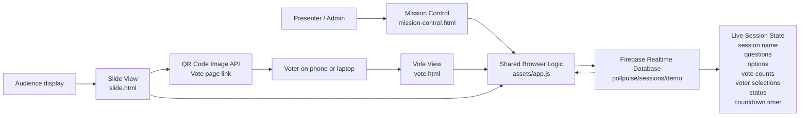
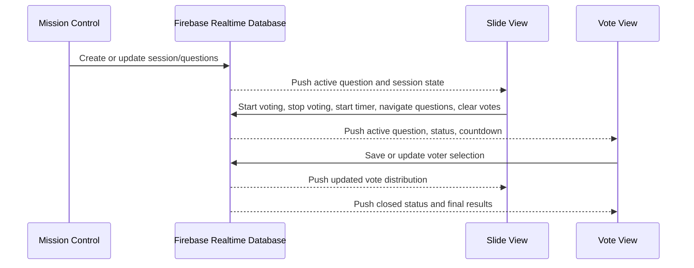
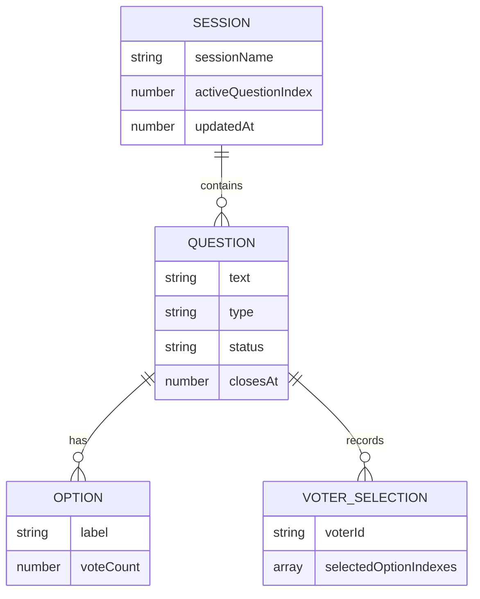
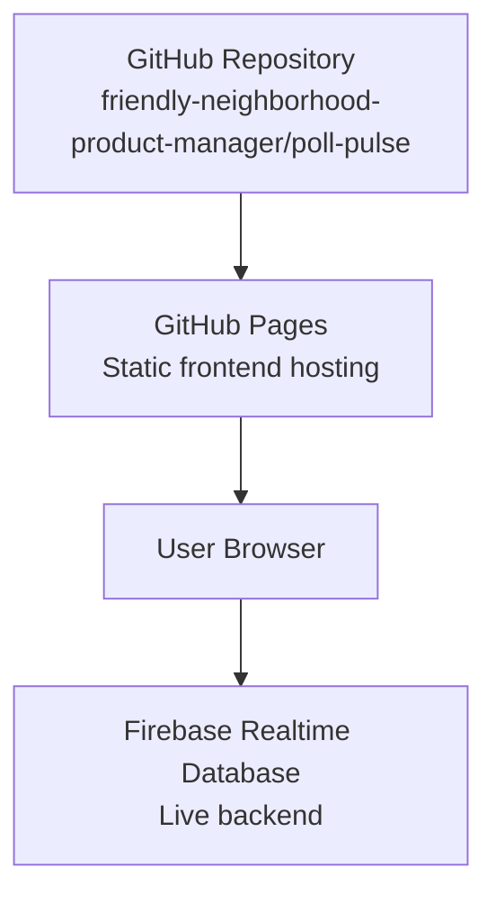

# PollPulse Architecture

PollPulse is a static GitHub Pages app with a Firebase Realtime Database backend. The app has no Oracle branding, no APEX dependency, and no voter authentication.

## Main Components

| Component | Purpose |
|---|---|
| `index.html` | Public home page for PollPulse. |
| `mission-control.html` | Presenter setup page for session name, question creation, editing, deletion, and active question management. |
| `vote.html` | Mobile-friendly voter page. Voters tap options directly; no submit button is required. |
| `slide.html` | Presenter display page with live results, QR code, timer controls, vote clearing, and question navigation. |
| `assets/app.js` | Shared app logic for Firebase sync, voting rules, timers, QR links, and live rendering. |
| `assets/styles.css` | Shared UI styling across all pages. |
| Firebase Realtime Database | Live shared backend for sessions, questions, votes, countdowns, and slide state. |

## Data Flow

## Current Backend Model

## Voting Rules

- Single-select questions allow one selected option at a time.
- Tapping a different single-select option replaces the previous vote.
- Multi-select questions allow voters to toggle multiple options.
- Voters can revise selections until voting closes.
- Each browser window gets its own temporary voter ID through `sessionStorage`.
- When voting closes, the Vote page keeps options visible, greys them out, highlights selected choices, and shows result distribution.

## Presenter Controls

Slide View supports:

- Start voting
- Timed voting stop for 15, 30, 45, or 60 seconds
- Stop voting now
- Clear votes for the active question
- First question
- Previous question
- Next question
- Last question
- QR code to open the Vote page

## Hosting

## Security Notes

This is a public demo app.

- Firebase Web API keys are public browser identifiers, not private server secrets.
- The Firebase key should remain restricted to the PollPulse GitHub Pages domain.
- Firebase Realtime Database rules currently allow unauthenticated demo reads/writes.
- Production use should add stronger rules, session-specific permissions, abuse protection, and optional presenter authentication.
